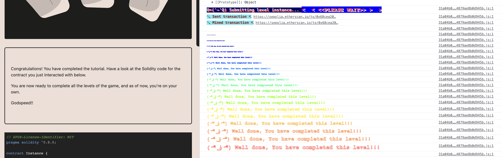
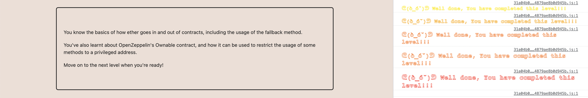

# Ethernaut Capture the Flag (CTF) Challenge Solutions

 

This repository contains tips to solving the Ethernaut Capture the Flag (CTF) challenges. I decided not to drop full solutions to the challenges, but rather give hints and tips to solving them. I hope you find this useful!

---

## Challenge 1: Hello Ethernaut

Solved✅

### **Solution**🏆

To solve the "Hello Ethernaut" challenge, read carefully the `abi` of the `HelloEthernaut` contract and call the `password` function, this will return the password which is used as the parameter for calling the `authenticate` function and this unlocks the level.

- Smart Contract: `contract/HelloEthernaut.sol`

---

## Challenge 2: Fallout

Solved✅

### Task 🧵
- Claim ownership of the contract
- Withdraw the contract's funds

### **Solution**🏆

To solve the "Fallback" challenge, You need to understand the how `receive` and `fallback` function works in Solidity

- When msg.data is empty, the `receive` function is called.
- When msg.data is not empty, the `fallback` function is called.

To solve this challenge, you need to send a transaction to the contract with some data, this will call the `receive` function and ownership will be transfered to you which is the first objective.
Lastly, since you are the owner of the contract, you have the access to call the `withdraw` function to drain out the wallet and this will unlock the level.

- Smart Contract: `contract/Fallout.sol`
## Disclaimer

This repository is for educational and demonstration purposes only. The code in this repository is not optimized for production use and may contain security vulnerabilities. Use it at your own risk.

